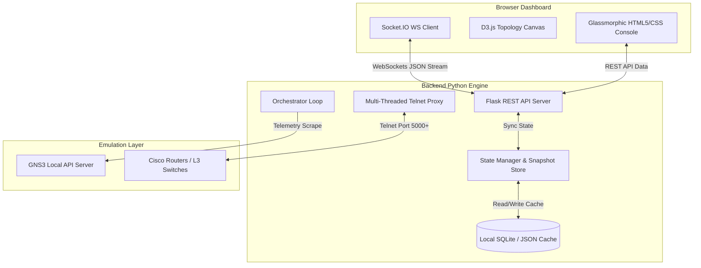

# NTM V3 Public Beta
> **Digital Twin Observability Console & Time-Travel Replay Engine for GNS3 Emulations**

Developed by **Nidhi**, the **NTM V3 Public Beta** (Network Time Machine) is a premium, standalone observability dashboard built to bridge the gap between virtual simulation environments (GNS3) and production-grade monitoring suites. It tunnels local device consoles, analyzes topology modifications, calculates live telemetry trends, audits security compliance, manages automated configuration backups, and allows engineers to "rewind and replay" network outage states.

---

## Key Features

* **Dual-Timeline Replay Engine**:
  * **Static Scrubber Timeline**: Play back, step forward/backward, pause, play, and inspect historical timeline frames. Select and delete individual frames from the index database with a clear `Delete Frame` button.
  * **Live Observability Timeline**: Tracks active system uptime, ticks continuously, and computes downstream **View Drift & Changes** compared to baseline references.
* **Force-Directed D3.js Topology Mapping**: A high-performance force-directed interface map that automatically groups routing components, visualizes traffic speed dot flows on active connections, and maps WAN/Cloud/ISP SVG node symbols dynamically.
* **Configuration Intelligence**: Replaces generic changes with a risk-scoring diff engine that filters out volatile metadata lines (NVRAM updates, clock steps) and displays the exact Cisco commands added, removed, or modified.
* **Security & Compliance Engine**: Performs automated checks for SSH security levels, AAA activation, Telnet policies, and local credential baselines.
* **Multi-Target Discord Webhook Manager**: Saves, lists, and manages multiple Discord Webhook targets, broadcasting configuration drift alerts to all configured channels simultaneously.
* **Evidence-Driven Root Cause Analysis (RCA)**: Evaluates confidence levels (`Low`, `Medium`, `High`) based on event correlation (interface down flaps, outages, unreachable devices, routing flaps) presenting a structured Device, Event, Impact, and Confidence trace.
* **Chronological Keyword Config Search**: Crawls through versioned device backups dynamically for terms like `vlan`, `ip route`, `username`, `description`, `access-list`, and `ospf`.
* **MVP Operational Report Export**: Generates text-based operational summaries (`exports/ntm_report.txt`) answering five key operational questions: *Is the network healthy?*, *When was the last backup?*, *What changed?*, *What devices are affected?*, and *Is there any risk?*.
* **Multi-Panel Drag-Resizable Splitters**: Custom HSL-colored resizing handles that adjust sideboard panel widths (`#main-splitter`), Node Inspector / Terminal heights (`#sidebar-splitter`), and bottom timeline heights (`#footer-splitter`) dynamically.
* **Header Collapse Toggles**: Minimize Node Inspector, Interactive Terminal, or Timeline Scrubber panels dynamically via header collapse/expand toggles to maximize network topology space.
* **Embedded Telnet Console Tunneling**: Real-time multi-threaded Telnet-to-WebSocket proxies translate raw virtual node consoles directly into a unified browser-based CLI terminal.
* **Automated 1-Hour Snapshots Retention**: Background pruner thread inside orchestrator sweeps database and prunes historical timeline logs older than exactly 1 hour to prevent local disk space accumulation.
* **Production Packaging & Sandboxing**: Fully packaged single-file portable executables with local database sandboxing routing SQL/JSON states securely to user profiles (`C:\Users\<username>\Network-Time-Machine\`) to avoid Windows directory authorization errors.

---

## System Architecture

The project is structured logically separating the backend CLI/Telemetry controller from the visual browser-based console:



### Key Modules:
* [app.py](file:///C:/Users/nidhi/PycharmProjects/Network-Time-Machine/backend/app.py): Entry point coordinating console server, browser auto-launch, and GNS3 port checks.
* [orchestrator.py](file:///C:/Users/nidhi/PycharmProjects/Network-Time-Machine/backend/orchestrator.py): Polling loop scrape manager, alarm triggers, and 1-hour timeline pruner.
* [state_manager.py](file:///C:/Users/nidhi/PycharmProjects/Network-Time-Machine/backend/state_manager.py): Session log compiler and memory index snapshot states manager (supporting state cache isolation on GNS3 project switches).
* [api_server.py](file:///C:/Users/nidhi/PycharmProjects/Network-Time-Machine/backend/api_server.py): Flask blueprints for sockets routing, REST JSON state endpoints, and Discord webhook configurations.
* [v2_intelligence.py](file:///C:/Users/nidhi/PycharmProjects/Network-Time-Machine/backend/v2_intelligence.py): Core analytics engine calculating weighted Network Health, event-based Replay Timeline widget payloads, and Root Cause Analysis.
* [cisco_config_time_machine.py](file:///C:/Users/nidhi/PycharmProjects/Network-Time-Machine/backend/cisco_config_time_machine.py): Automated configuration collector, Noise-Filtered Command-level diff builder, and Operational Report exporter.
* [cli_engine.py](file:///C:/Users/nidhi/PycharmProjects/Network-Time-Machine/backend/cli_engine.py): Main terminal text command parser executing commands like `timeline start scrub` and `show topology live`.
* [console_proxy.py](file:///C:/Users/nidhi/PycharmProjects/Network-Time-Machine/backend/console_proxy.py): Low-level Telnet connector mapping network consoles to WebSockets.
* [frontend/index.html](file:///C:/Users/nidhi/PycharmProjects/Network-Time-Machine/backend/frontend/index.html): Main console browser layout, D3 visualization rendering, Discord webhook management panel, Resizable Splitters dragging script, and console styling.

---

## Setup & Launch Guide

### 1. Standalone Portable Executable (Fastest)
1. Navigate to the downloads folder [ntm-web/](file:///C:/Users/nidhi/PycharmProjects/Network-Time-Machine/ntm-web/).
2. Run **`NTM.exe`** (Zero-Install standalone).
3. The server will boot, start Telnet proxies locally, and automatically launch your default browser to **`http://localhost:5050`**.

### 2. Windows Installer Setup Wizard
1. Navigate to [ntm-web/](file:///C:/Users/nidhi/PycharmProjects/Network-Time-Machine/ntm-web/).
2. Double-click **`NTM_v3_Setup.exe`**.
3. Follow the wizard. It places the app under `Program Files\Network Time Machine`, registers the desktop shortcut with the brand icon, and provides a control panel uninstaller.

> [!WARNING]
> **Windows SmartScreen Notice**: If Windows blocks the files with a *"These files can't be opened"* warning:
> 1. Open File Explorer and find the downloaded file in your `Downloads` folder.
> 2. Right-click the `.exe` file and select **Properties**.
> 3. Under the General tab, check the **Unblock** box at the bottom, click **Apply**, and launch the app.

---

## Developer Compilation & Build Pipeline

If you want to modify assets or backend scripts, you can rebuild the executable binaries and setup files:

### Build Requirements
* Python 3.12+ (dependencies: Flask, Flask-SocketIO, Eventlet, PyInstaller, netmiko, requests)
* Inno Setup Compiler 6 (available at AppData folder)

### Recompiling Standalone `NTM.exe`
Run the PyInstaller packaging script:
```powershell
# Inside backend/ folder
python -m PyInstaller --clean --onefile --name "NTM" --add-data "frontend;frontend" --hidden-import "engineio.async_drivers.threading" --hidden-import "socketio" --hidden-import "engineio" --hidden-import "flask" --hidden-import "flask_cors" --hidden-import "flask_socketio" --hidden-import "netmiko" --hidden-import "paramiko" --hidden-import "ntc_templates" --hidden-import "requests" --icon "logo-icon.ico" app.py
```
This cleans build caches, bundles frontend folders, and compiles output into `dist/NTM.exe`.

### Rebuilding Windows Setup Wizard `NTM_v3_Setup.exe`
Run the Inno Setup compiler referencing the [setup.iss](file:///C:/Users/nidhi/PycharmProjects/Network-Time-Machine/backend/setup.iss) script:
```powershell
# Inside backend/ folder
& "C:\Users\nidhi\AppData\Local\Programs\Inno Setup 6\ISCC.exe" setup.iss
```
This compiles and packages the setup program into `installer/NTM_v3_Setup.exe`.

---

## CLI Commands Cheat Sheet

Type these commands directly inside the **NTM Interactive Terminal** on the dashboard or use the click shortcuts:

| Command | Action |
|---|---|
| `show topology live` | Displays the current active network configuration details |
| `show events live` | Prints logs of live interface flaps and node failures |
| `show rootcause` | Runs Root Cause Analysis (RCA) on active network anomalies |
| `show stability` | Computes the overall stability index percentage score |
| `simulate outage` | Simulates a virtual interface outage to trigger alerts |
| `timeline start scrub` | Locks Virtual Observability to scrub time-travel mode |
| `timeline load <file.json>` | Restores a saved timeline session into memory |
| `timeline save <file.json>` | Exports the current timeline session to local disk |
| `end scrub` | Exits scrubber travel mode and returns console to Live view |
| `gns3 status` | Queries GNS3 API connector host, project ID, and active status |
| `gns3 connect <host> <id>` | Connects to a GNS3 server/project dynamically and resets cache |
| `timeline reset` | Clears all recorded timeline frames, force-syncs state, and records a fresh baseline |

---

## License & Attribution

Developed and maintained by **Nidhi** (c) 2026. Private Proprietary Codebase for local GNS3 simulation environments.
